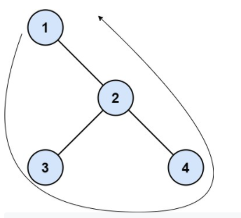
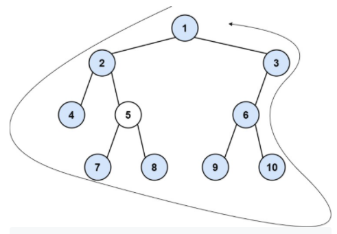

# 545. Boundary of Binary Tree

A binary tree boundary is the set of nodes (no duplicates) denoting the union of the left boundary, leaves, and right boundary.

The left boundary is the set of nodes on the path from the root to the left-most node. The right boundary is the set of nodes on the path from the root to the right-most node.

The left-most node is the leaf node you reach when you always travel to the left subtree if it exists and the right subtree if it doesn't. The right-most node is defined in the same way except with left and right exchanged. Note that the root may be the left-most and/or right-most node.

Given the root of a binary tree, return the values of its boundary in a counter-clockwise direction starting from the root.

## Examples

### Example 1



```
Input: root = [1,null,2,3,4]
Output: [1,3,4,2]
Explanation:
The left boundary is the nodes [1,2,3].
The right boundary is the nodes [1,2,4].
The leaves are nodes [3,4].
Unioning the sets together gives [1,2,3,4], which is [1,3,4,2] in counter-clockwise order.
```

### Example 2




```
Input: root = [1,2,3,4,5,6,null,null,null,7,8,9,10]
Output: [1,2,4,7,8,9,10,6,3]
Explanation:
The left boundary are node 1,2,4. (4 is the left-most node according to definition)
The left boundary is nodes [1,2,4].
The right boundary is nodes [1,3,6,10].
The leaves are nodes [4,7,8,9,10].
Unioning the sets together gives [1,2,3,4,6,7,8,9,10], which is [1,2,4,7,8,9,10,6,3] in counter-clockwise order.
```

## Constraints
- The number of nodes in the tree is in the range [0, 104].
- -1000 <= `Node.val` <= 1000