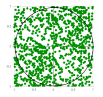

# Estiminating the value of Pi using Monte Carlo

## Monte Carlo Estimation

Monte Carlo methods are a broad class of computational algorithms that rely on repeated random sampling to obtain numerical results. 

## Estimation of Pi

The idea is to simulate random (x, y) points in a 2-D plane with domain as a square of side 1 unit. Imagine a circle inside the same domain with same diameter and inscribed into the square. We then calculate the ratio of number of points that lie inside the circle and total number of generated points.

We know that the area of the square is 1 square unit while that of the circle is $π * (\frac{1}{2})^2 = \frac{π}{4}$. Now for a very large number of generated points,

$$\frac{area of the circle}{area of the square} = \frac{number of points generated inside the circle}{number of points generated inside the square}$$

That is, 

$$π = 4 * \frac{number of points generated inside the circle}{number of points generated inside the square}$$

All we have to do is generate random (x, y) pairs and then check if $x^2 + y^2 ≤ 1$. If yes, we incrememnt the number of points that appears inside the circle. In randomized simulation aglorithms like Monte Carlo, the more the number of iterations, the more accurate the result is.

## The Algorithm
1. Initialize number of circle points, number of square points and interval to 0
2. Generate random point x
3. Generate random point y
4. Calculate $d = x^2 + y^2$
5. If d ≤ 1, increment the number of circle points
6. Increment the number of square points
7. Increment the interval
8. If increment < number of iterations, repeat from 2
9. Calculate $π = 4 * \frac{number of circle points}{number of square points}$
10. Terminate